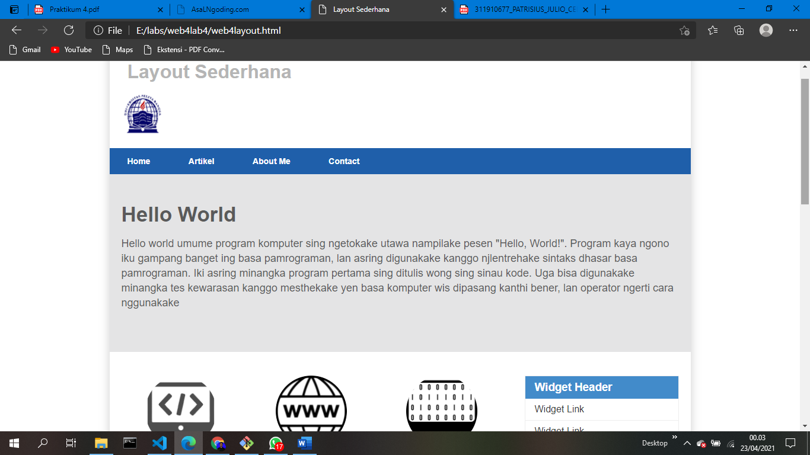
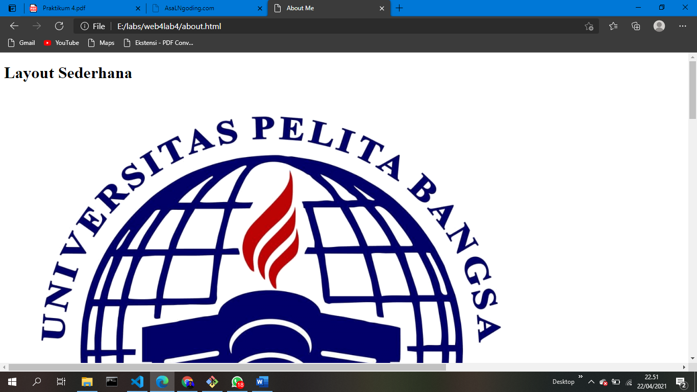
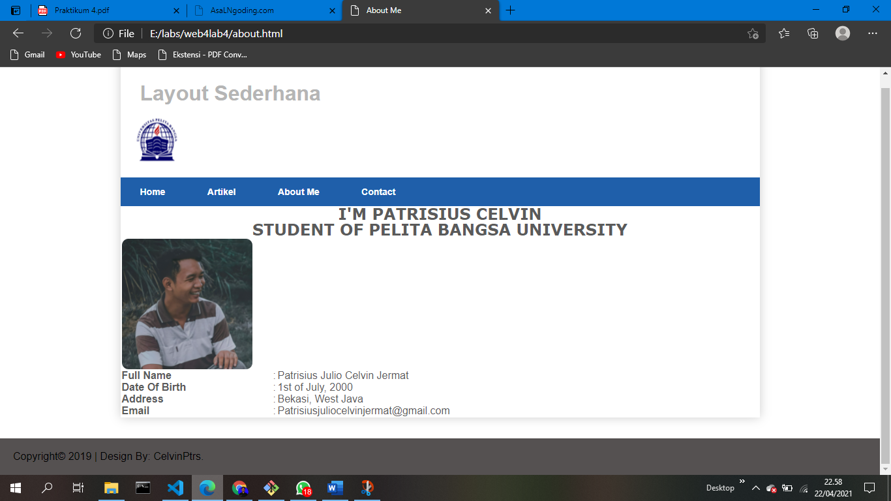
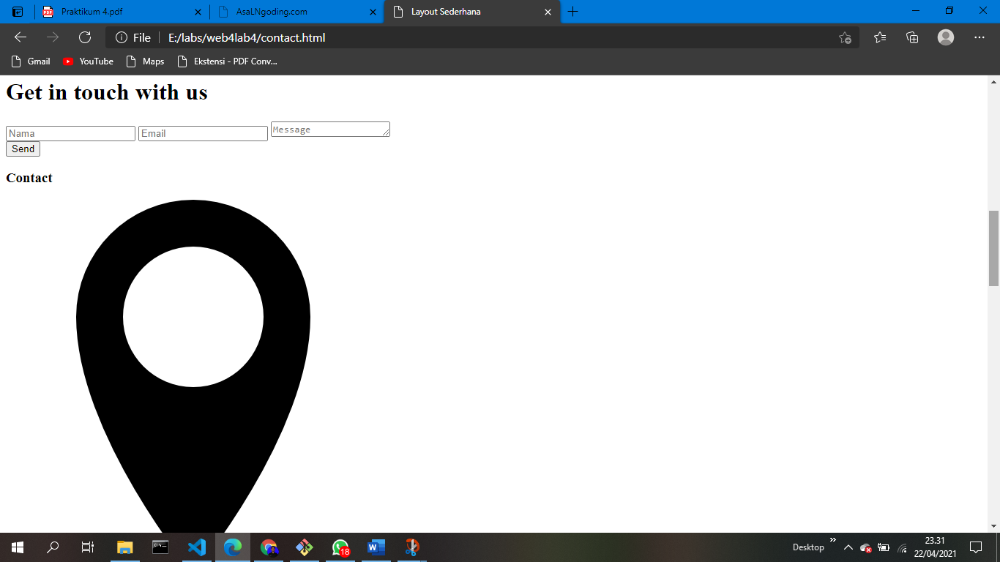
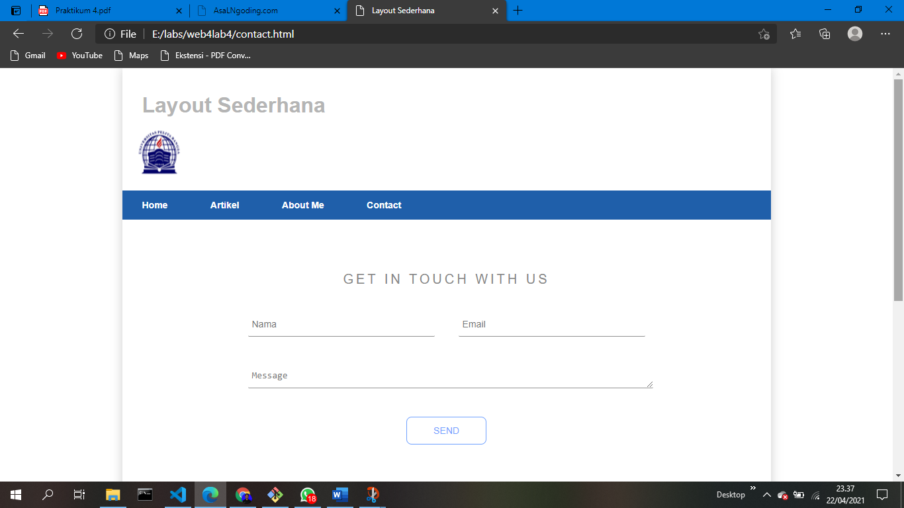
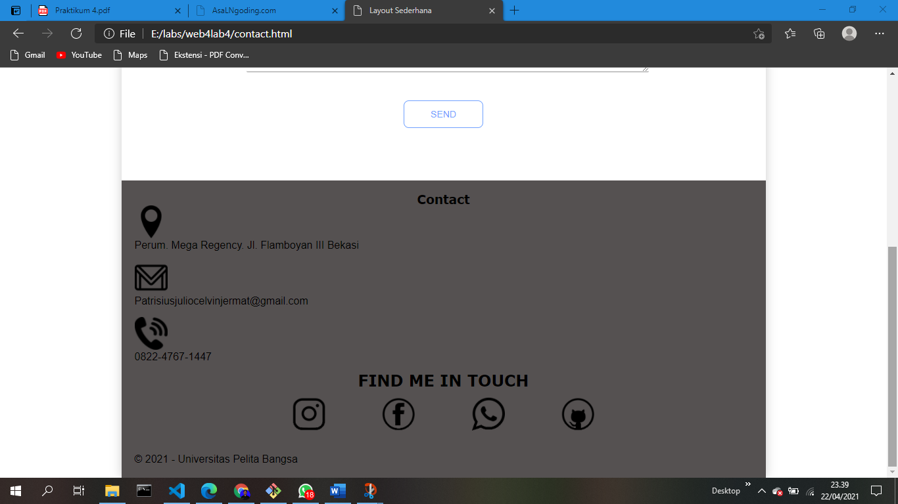

# web4lab4
## Membuat layout 

### Menambahkan layout pada menu About dan Contact
Berikut proses menambahkan layout pada menu HTML:

Pembuatan layout untuk menu About
Langkah pertama :
Buat file HTML terlebih dahulu
<!DOCTYPE html>
<html lang="en">
<head>
    <meta charset="UTF-8">
    <meta http-equiv="X-UA-Compatible" content="IE=edge">
    <meta name="viewport" content="width=device-width, initial-scale=1.0">
    <title>About Me</title>
    <link rel="stylesheet" href="style.css">
</head>
<body>

    

        <header>
            <h1>Layout Sederhana</h1>
            
        </header>
        <nav>
            <a href="web4layout.html">Home</a>
            <a href="artikel.html">Artikel</a>
            <a href="about.html">About Me</a>
            <a href="contact.html">Contact</a>
        </nav>
    
  

</body>
</html>

 Karena saya ingin membuat tampilan yang sama dengan file layout sebelumnya, jadi saya hanya mengambil beberapa elemen saja lalu, saya tambahkan : 

<section id="bungkus">
        <h1>I'M PATRISIUS CELVIN</h1>
        <h2>STUDENT OF PELITA BANGSA UNIVERSITY </h2>
        <table>
            <tr>
                <td></td>
            </tr>
            <tr>
                <td><b>Full Name</b></td>
                <td>:</td>
                <td>Patrisius Julio Celvin Jermat</td>
            </tr>
            <tr>
                <td><b>Date Of Birth</b></td>
                <td>:</td>
                <td>1st of July, 2000</td>
            </tr>
            <tr>
                <td><b>Address</b></td>
                <td>:</td>
                <td>Bekasi, West Java</td>
            </tr>
            <tr>
                <td><b>Email</b></td>
                <td>:</td>
                <td>Patrisiusjuliocelvinjermat@gmail.com</td>
            </tr>
        </table>
    </section>

Dari file layout tersebut dan pastikan elemen <nav></nav> sudah saling terhubung satu sama lain. Maka hasilnya akan seperti ini :

Langkah kedua kita tambahkan CSSnya :
  .about h3{
      text-align: center;
      font-weight: bold;
      font-family: Verdana, Geneva, Tahoma, sans-serif;
  }
  .about img{
      width: 50px;
      height: 50px;
  }

Kemudian CSSnya kita gabungkan dengan CSS sebelumnya maka hasilnya akan seperti ini :

2. Pembuatan layout untuk menu Contact
Langkah pertama :
Buat file HTML terlebih dahulu
<!DOCTYPE html>
<html lang="en">
<head>
    <meta charset="UTF-8">
    <meta http-equiv="X-UA-Compatible" content="IE=edge">
    <meta name="viewport" content="width=device-width, initial-scale=1.0">
    <title>About Me</title>
    <link rel="stylesheet" href="style.css">
</head>
<body>

    

        <header>
            <h1>Layout Sederhana</h1>
            
        </header>
        <nav>
            <a href="web4layout.html">Home</a>
            <a href="artikel.html">Artikel</a>
            <a href="about.html">About Me</a>
            <a href="contact.html">Contact</a>
        </nav>
    
  

</body>
</html>

Lalu tambahkan :

            

              <h1>Get in touch with us</h1>
              <input type="text" class="nama" placeholder="Nama">
              <input type="email" class="email" placeholder="Email">
              <textarea rows="1" placeholder="Message" class="message"></textarea>
            
  
            <button>Send</button> 
        

        <footer>
            

                <h3>Contact</h3>
                
                
Perum. Mega Regency. Jl. Flamboyan III Bekasi
 
                
                
Patrisiusjuliocelvinjermat@gmail.com
 
                
                
0822-4767-1447
 
                
            

            

                <h2>FIND ME IN TOUCH </h2>
                
                
                
                
            

            
&copy; 2021 - Universitas Pelita Bangsa

        </footer>

Maka hasilnya seperti ini : 

Selanjutnya tambahkan file CSSnya :
.sm a{
    display: inline-block;
    font-size: 40px;
    width: 100px;
    height: 100px;
    line-height: 100px;
    text-align: center;
    color: #6ab04c;
    margin: 0 16px;
    transition: .4s linear;
    position: relative;
    background-color: rgb(85, 81, 81);
  }
  
  .sm a::before, .sm a::after{
    content: '';
    position: absolute;
    box-sizing: border-box;
    width: 100%;
    height: 100%;
    left: 0;
    top: 0;
    transition: .4s linear;
  }
  
  .sm a:hover{
    transform: scale(.8);
  }
  
  .sm a:hover::before{
    border-left: 4px solid;
    border-right: 4px solid;
    transform: skewX(20deg);
  }
  
  .sm a:hover::after{
    border-top: 4px solid;
    border-bottom: 4px solid;
    transform: skewY(-20deg);
  }

  .contact-section{
    background: #ffffff;
    padding: 80px 0;
    text-align: center;
  }
  
  .inner-width{
    max-width: 600px;
    margin: auto;
    padding: 0 20px;
  }
  
  .contact-section h1{
    font-size: 20px;
    font-family: Arial, Helvetica, sans-serif;
    color: #888;
    margin-bottom: 40px;
    text-transform: uppercase;
    letter-spacing: 4px;
    font-weight: 400;
  }
  
  .nama,.email,.message{
    background: none;
    border:none;
    outline: none;
    border-bottom: 1px solid;
    color: #888;
    padding: 10px 6px;
    font-size: 14px;
    margin-bottom: 40px;
  }
  
  .nama{
    float: left;
    width: 270px;
  }
  
  .email{
    float: right;
    width: 270px;
  }
  
  .message{
    min-width: 100%;
    max-width: 100%;
  }
  
  
  .contact-section button{
    background: none;
    color: #70a1ff;
    border: 1px solid #70a1ff;
    padding: 12px 40px;
    border-radius: 8px;
    text-transform: uppercase;
    font-size: 14px;
    transition: 0.4s linear;
    cursor: pointer;
  }
  
  .contact-section button:hover{
    background: #70a1ff;
    color: #fff;
  }
  
  
  @media screen and (max-width:600px){
    .name,.email{
      width: 100%;
    }
  }

Maka tampilannya akan seperti ini :

